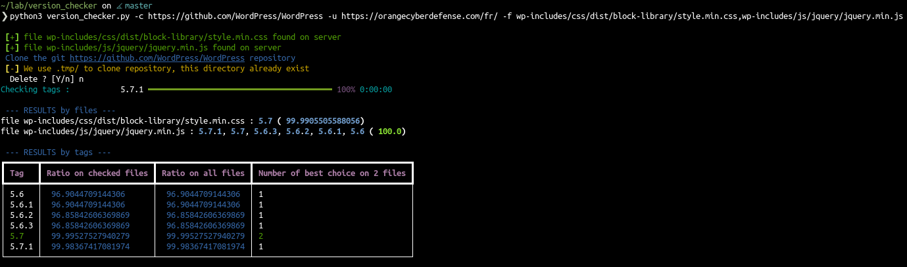

# Version checker

Tools to check a remote website version based on local git repository
This tool will help you to find the website version of the opensource project in use based on statics files like js,css,xml...

[](https://asciinema.org/a/WYD8WtfnULpbfkz5uKMmqLExF)

## Install
```
python3 -m pip install -r requirements.txt
```

## Run

You can run the project with the following options : 
- -u : the remote website url
- -c or -l : use a remote git project to clone locally (inside the .tmp/ folder) or use an existing folder (be careful, this options will force checkout the different tags and so this can break unsaved work)
- -f : the list of files to check (comma separated)
- -v : add verbosity (optional)
- -p : path corresponding to the web folder inside the git repository (useful in case of public/ folder by example)
- -P : add proxy options (optional)
- -t : the list of tags to check coma separated instead of the (optional)

Example : 
```
python3 version_checker.py -c https://github.com/WordPress/WordPress -u https://wordpress.website.example/ -f wp-includes/css/dist/block-library/style.min.css,wp-includes/js/jquery/jquery.min.js
```

